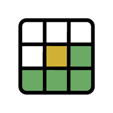

#  Wordle Clone 
Wordle Clone is a web-based game inspired by the popular word-guessing game Wordle. It's built using React JS and provides an engaging and challenging experience for players to test their word-solving skills.

## 📖 Introduction 

Wordle is a game where players try to guess a secret word by guessing different combinations of letters. This project is a clone of the original Wordle game, built using React JS.

## 🚀 Features

- **Simple Interface**: Clean and intuitive UI for an enjoyable gaming experience.
- **Random Words**: Each game session starts with a randomly selected secret word.
- **Letter Guessing**: Guess the letters and find out if they are in the secret word.
- **Feedback**: Get immediate feedback on your guesses with colored tiles.

## 🌐 Demo

You can access the Wordle Clone website directly [here](https://your-website-url.com).

## ⚙️ Installation

To get started with the Wordle Clone, follow these steps:

1. Clone this repository.
2. Navigate to the project directory.
3. Install dependencies using `npm install` or `yarn install`.

## 🌟 Contributing
We welcome contributions to enhance the Wordle Clone! If you have any ideas, bug fixes, or new features, please follow these steps:

1. Fork the repository 
2. Create a new branch (`git checkout -b feature/your-feature`) 
3. Commit your changes (`git commit -m 'Add your feature'`) 
4. Push to the branch (`git push origin feature/your-feature`) 
5. Open a Pull Request 

## 📝 License
This project is licensed under the MIT License. 📄

## 🙏 Acknowledgements

- **React.js** - The JavaScript library used for building the user interface. 
- **Create React App** - The toolchain used to set up the React.js development environment.
- **Wordle** - The original word-guessing game that inspired this project.
